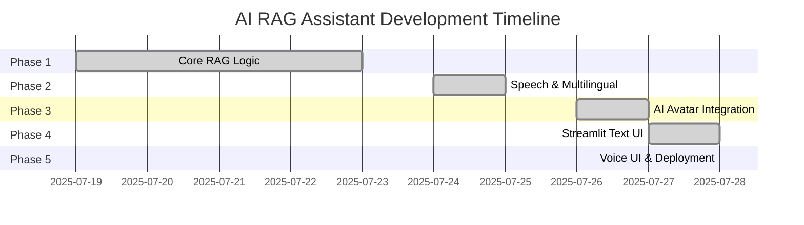

# 🧠 AI-Powered Voice-Driven Multilingual RAG Assistant

[](https://www.python.org/downloads/)
[](LICENSE)
[]()

## 🔍 Overview

An intelligent AI assistant that enables users to upload PDF documents (manuals, legal documents, research papers) and interact with them through **text or voice queries**. The system provides contextually relevant answers in **multiple languages** through text responses, voice synthesis, or AI-generated avatar videos.

Built with **open-source LLMs**, **advanced RAG (Retrieval-Augmented Generation) pipelines**, and **comprehensive multilingual support** to ensure accessibility across diverse user bases and use cases.

---

## 🎯 Key Features

### 📄 Document Processing
- **PDF Upload & Parsing** - Support for complex document structures
- **Intelligent Text Chunking** - Optimized content segmentation
- **Vector Embeddings** - Semantic search capabilities

### � AI & Language Processing  
- **Open-Source LLM Integration** - DeepSeek, Mistral models
- **Advanced RAG Pipeline** - Context-aware response generation
- **Multilingual Support** - Automatic language detection and translation

### 🔊 Voice & Interaction
- **Speech-to-Text** - Voice query input
- **Text-to-Speech** - Audio response generation  
- **AI Avatar Integration** - Lip-synced video responses

### 🌐 User Interface
- **Streamlit Web App** - Interactive browser interface
- **Real-time Audio Recording** - Seamless voice interaction
- **Responsive Design** - Cross-device compatibility

---

## 🧪 Use Cases

| Domain | Application |
|--------|-------------|
| **Legal Services** | Multilingual client assistance and document analysis |
| **Technical Support** | Voice-driven appliance manuals and troubleshooting |
| **Education** | Rural education tools in local languages |
| **Healthcare** | Elderly-friendly voice assistants for medical information |
| **Business** | Document Q&A for training materials and procedures |

---

## 🔧 Technology Stack

### Core AI & ML
| Component | Technology | Purpose |
|-----------|------------|---------|
| **Language Models** | DeepSeek, Mistral | Text generation and reasoning |
| **Embeddings** | SentenceTransformers | Semantic text representation |
| **Vector Store** | FAISS | Fast similarity search |

### Document Processing
| Component | Technology | Purpose |
|-----------|------------|---------|
| **PDF Parsing** | PyPDF2, PyMuPDF | Extract text from documents |
| **Text Processing** | Custom splitters | Optimize content for retrieval |

### Speech & Language
| Component | Technology | Purpose |
|-----------|------------|---------|
| **Speech Recognition** | SpeechRecognition, Whisper | Voice input processing |
| **Text-to-Speech** | gTTS | Audio response generation |
| **Language Detection** | langdetect | Automatic language identification |
| **Translation** | Google Translate API | Multilingual support |

### Interface & Deployment
| Component | Technology | Purpose |
|-----------|------------|---------|
| **Web Interface** | Streamlit | Interactive user interface |
| **Audio Components** | streamlit-audio-recorder | Voice recording integration |
| **Avatar Generation** | D-ID API | AI-powered video responses |

---

## 🚀 Development Phases

Our project is structured in five progressive phases, each building upon the previous to create a comprehensive AI assistant:

### ✅ Phase 1: Core RAG Logic & Text Interaction  
**Lead Developer**: Bharath | **Deadline**: July 23, 2025

#### 🎯 Objectives
Establish the foundational RAG pipeline with basic text-based interaction capabilities.

#### � Tasks
- [x] Initialize VS Code project and GitHub repository
- [x] Implement robust PDF parsing using `PyPDF2`
- [x] Develop intelligent text chunking algorithms
- [x] Generate semantic embeddings with `SentenceTransformers`
- [x] Integrate open-source LLM (DeepSeek 7B)
- [x] Build complete RAG pipeline (parse → embed → retrieve → respond)
- [x] Create CLI interface via `main.py`

**✅ Deliverable**: Context-aware text responses from PDF content using RAG methodology.

---

### ✅ Phase 2: Speech I/O & Multilingual Support  
**Lead Developer**: Suhas | **Deadline**: July 25, 2025

#### 🎯 Objectives
Extend the system with voice interaction and comprehensive multilingual capabilities.

#### � Tasks
- [x] Implement microphone input using `SpeechRecognition`
- [x] Add voice synthesis using `gTTS`
- [x] Deploy language detection with `langdetect`
- [x] Integrate query translation to English
- [x] Implement response translation to user's native language
- [x] Validate complete speech → RAG → speech workflow

**✅ Deliverable**: Voice-driven multilingual interaction with spoken responses.

---

### ✅ Phase 3: AI Avatar Integration  
**Lead Developer**: Sreeya | **Deadline**: July 27, 2025

#### 🎯 Objectives
Enhance user experience with AI-generated avatar responses for visual communication.

#### � Tasks
- [x] Integrate D-ID API for avatar generation
- [x] Convert audio/text to synchronized lip-synced video responses
- [x] Develop modular avatar components for Streamlit integration
- [x] Optimize video generation performance

**✅ Deliverable**: AI avatar delivering visually synchronized spoken responses.

---

### ✅ Phase 4: Streamlit Interface - Text & File UI  
**Lead Developer**: Kiran | **Deadline**: July 28, 2025

#### 🎯 Objectives
Create an intuitive web-based interface for document upload and text-based interactions.

#### 📋 Tasks
- [x] Design PDF upload interface with validation
- [x] Implement chat-style text input/output
- [x] Display contextual text responses
- [x] Add language selection controls
- [x] Test complete text-based workflow in browser

**✅ Deliverable**: Professional web application for PDF upload and text-based Q&A.

---

### ✅ Phase 5: Complete Voice & Avatar UI + Deployment  
**Lead Developer**: Vipul | **Deadline**: July 28, 2025

#### 🎯 Objectives
Finalize the application with full voice and avatar capabilities, then deploy for production use.

#### � Tasks
- [x] Integrate microphone components in Streamlit
- [x] Implement TTS audio playback functionality
- [x] Embed D-ID avatar video display
- [x] Deploy application using Streamlit Cloud/HuggingFace Spaces
- [x] Conduct comprehensive end-to-end testing

**✅ Deliverable**: Production-ready web application with complete voice and avatar interaction capabilities.

---

## � Project Structure

```
ai-rag-assistant/
├── 📄 main.py                    # Entry point and CLI interface
├── 📋 requirements.txt           # Python dependencies
├── 📖 README.md                  # Project documentation
├── ⚙️  config.py                 # Configuration settings
│
├── 📂 modules/                   # Core functionality modules
│   ├── 🔧 __init__.py
│   ├── 📄 pdf_parser.py          # PDF document processing
│   ├── ✂️  text_splitter.py       # Content chunking algorithms
│   ├── 🎯 embedder.py            # Vector embedding generation
│   ├── 🧠 rag_pipeline.py        # RAG orchestration logic
│   ├── 💬 llm_query.py           # LLM interaction layer
│   ├── 🎙️  speech_module.py       # Voice I/O handling (Phase 2)
│   ├── 🌍 multilingual.py        # Language processing (Phase 2)
│   └── 🎭 avatar_generator.py    # AI avatar creation (Phase 3)
│
├── 📂 frontend/                  # User interface components
│   ├── 🌐 streamlit_ui.py        # Main Streamlit application (Phase 4-5)
│   ├── 🔊 audio_components.py    # Audio recording/playback
│   └── 🎬 avatar_components.py   # Avatar display components
│
├── 📂 tests/                     # Test suites
│   ├── 🧪 test_pdf_parser.py
│   ├── 🧪 test_text_splitter.py
│   └── 🧪 test_rag_pipeline.py
│
├── 📂 sample_data/               # Sample documents and outputs
│   ├── 📄 sample_document.pdf
│   ├── 📝 sample_content.txt
│   └── 🗂️  chunked_output.txt
│
└── 📂 assets/                    # Static resources
    ├── 📄 sample.pdf
    ├── 🎵 test_audio.wav
    └── 🖼️  avatar_templates/
```

---

## 🛠️ Installation & Setup

### Prerequisites
- Python 3.8 or higher
- Git
- 4GB+ RAM recommended
- Internet connection for model downloads

### Quick Start

1. **Clone the repository**
   ```bash
   git clone https://github.com/8harath/Vishvam.git
   cd Vishvam
   ```

2. **Create virtual environment**
   ```bash
   python -m venv .venv
   
   # Windows
   .venv\Scripts\activate
   
   # macOS/Linux
   source .venv/bin/activate
   ```

3. **Install dependencies**
   ```bash
   pip install -r requirements.txt
   ```

4. **Configure environment variables** (Optional)
   ```bash
   # Create .env file for API keys
   echo "D_ID_API_KEY=your_d_id_api_key_here" > .env
   ```

---

## 🚀 Usage

### Command Line Interface (Phase 1)
```bash
python main.py
# Follow prompts to upload PDF and ask questions
```

### Web Interface (Phases 4-5)
```bash
streamlit run frontend/streamlit_ui.py
```
Navigate to `http://localhost:8501` in your browser.

### Key Commands
- **Upload PDF**: Drag and drop or use file picker
- **Text Query**: Type questions in the chat interface  
- **Voice Query**: Click microphone button and speak
- **Language Selection**: Choose output language from dropdown
- **Avatar Mode**: Toggle AI avatar responses

---

## 🧪 Testing

Run the comprehensive test suite:
```bash
# Run all tests
python -m pytest tests/ -v

# Run specific test modules
python -m pytest tests/test_pdf_parser.py -v
python -m pytest tests/test_text_splitter.py -v

# Generate coverage report
python -m pytest tests/ --cov=modules --cov-report=html
```

---

## � Development Team

| Phase | Lead Developer | Responsibility | Status |
|-------|----------------|----------------|--------|
| **Phase 1** | 👨‍💻 **Bharath** | Core RAG Logic & Text Interaction | ✅ Complete |
| **Phase 2** | 👨‍💻 **Suhas** | Speech I/O & Multilingual Support | ✅ Complete |
| **Phase 3** | 👩‍💻 **Sreeya** | AI Avatar Integration | ✅ Complete |
| **Phase 4** | 👨‍💻 **Kiran** | Streamlit UI - Text Interface | ✅ Complete |
| **Phase 5** | 👨‍💻 **Vipul** | Voice UI & Deployment | ✅ Complete |

---

## 📅 Project Timeline



---

## 🤝 Contributing

We welcome contributions to improve the AI RAG Assistant! Please follow these guidelines:

### Getting Started
1. Fork the repository
2. Create a feature branch (`git checkout -b feature/amazing-feature`)
3. Follow our coding standards and add tests
4. Commit your changes (`git commit -m 'Add amazing feature'`)
5. Push to the branch (`git push origin feature/amazing-feature`)
6. Open a Pull Request

### Code Standards
- Follow PEP 8 for Python code
- Add docstrings for all functions and classes
- Include unit tests for new functionality
- Update documentation as needed

---

## 📄 License

This project is licensed under the MIT License - see the [LICENSE](LICENSE) file for details.

---

## 🆘 Support & Contact

- **GitHub Issues**: [Report bugs or request features](https://github.com/8harath/Vishvam/issues)
- **Documentation**: [Project Wiki](https://github.com/8harath/Vishvam/wiki)
- **Email**: bharath@example.com

---

## 🙏 Acknowledgments

- OpenAI for Whisper speech recognition models
- Hugging Face for transformer models and embeddings
- D-ID for AI avatar generation API
- Streamlit team for the excellent web framework
- The open-source community for various libraries and tools

---

<div align="center">

**Built with ❤️ by the Vishvam Development Team**

[](https://github.com/8harath/Vishvam)
[](https://github.com/8harath/Vishvam/fork)

</div>

